# Introduction to DRAM

## Basic Dram STRUCTURE

- Channels
- Ranks
- Chips
- Banks
- Array
- Row
- Address
- DRAM cell
- MOS + Capacitance + Sense Amplifier

https://www.youtube.com/playlist?list=PLTd6ceoshpreE_xQfQ-akUMU1sEtthFdB

  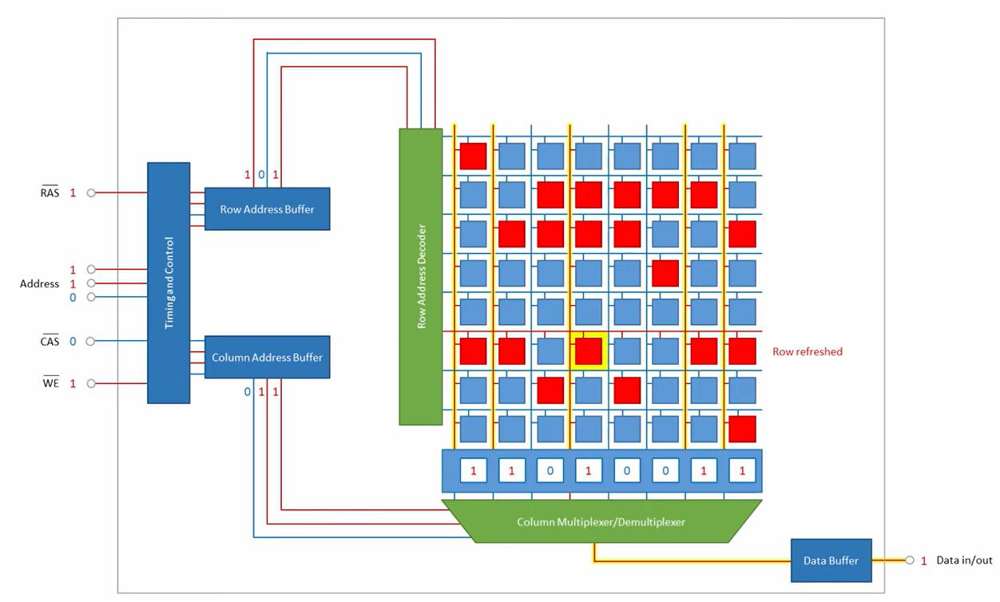

- The DRAM consist of address decoders of both row and column
- Pins for column address selection are all active low
- The data in/out bus is a bidirectional bus for both reading and writing data into the dram cell.
- Column address mux/demux are used to select the latched data when reading, and select the data to write into the latch during write operation.

## DRAM oprations
1. The cell must be precharged first.
2. Then the sense amplifiers readout the difference, indication of binary 0 or 1
3. Then from the Row address provided by the row address decoder, select the word line.
4. Then the word selected is then latched into the latch waiting to be selected by the column mux.
5. Since reading is destructive, i.e. the electrons within the DRAM cell was lost while reading, the read latch data are later write back again into the same DRAM row.
6. Same goes with write operation, except this time the data comes from the outside world.

## Read and Write operation timing diagram

- Timing diagram shows an active low DRAM architecture, row address is first being inputted then the column address.

  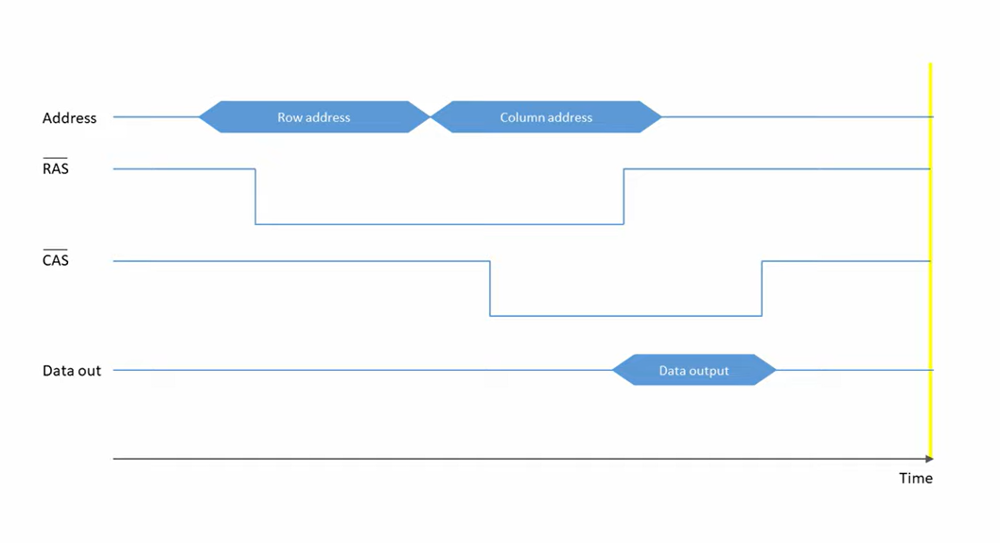

## Flow of DRAM read write Opeartion

  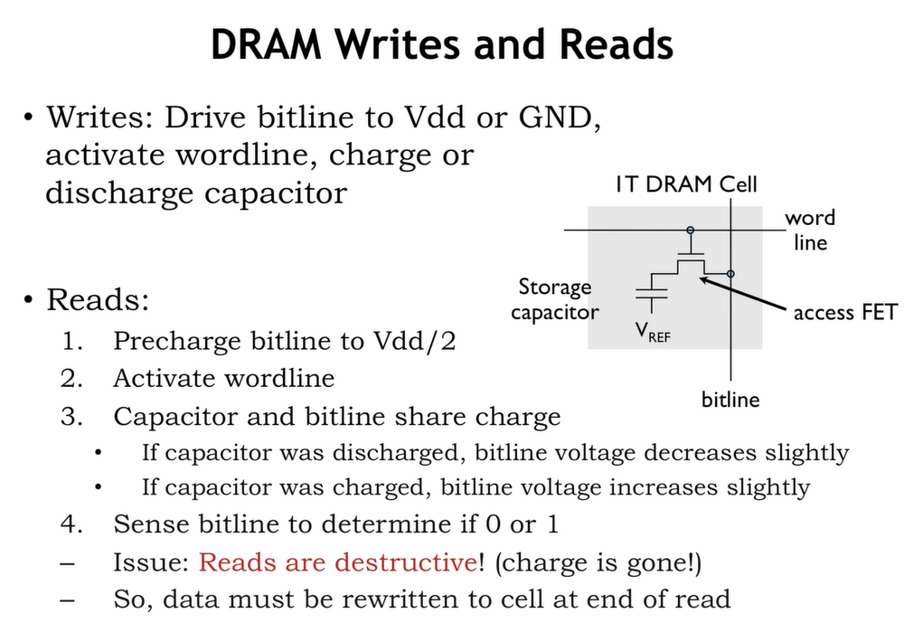

# DIMM organization

## Reading out bytes

  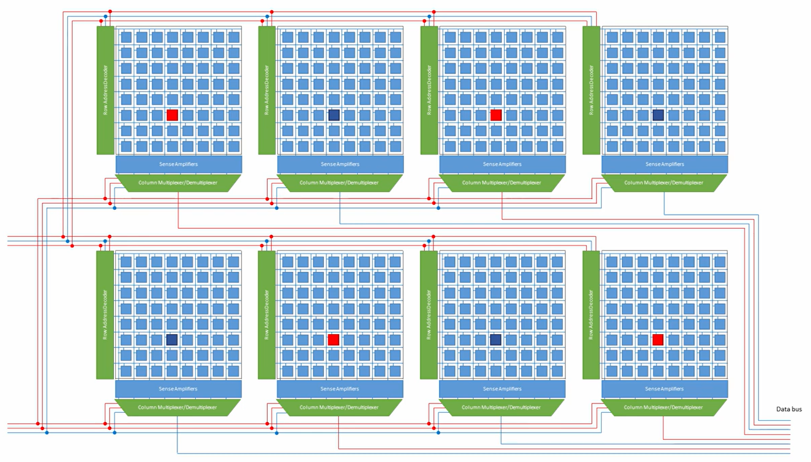

- To enable reading a whole byte or whole word of memory from DRAM, multiple cells capable of reading 1 bit of data is grouped into Bank. These are all fed with the same column and row address.

## Rectangular memory cell
- Since the Pin is expensive, usually rectangular structure is selected to minimize the pin required.
- There are usually a lot more rows then columns.

  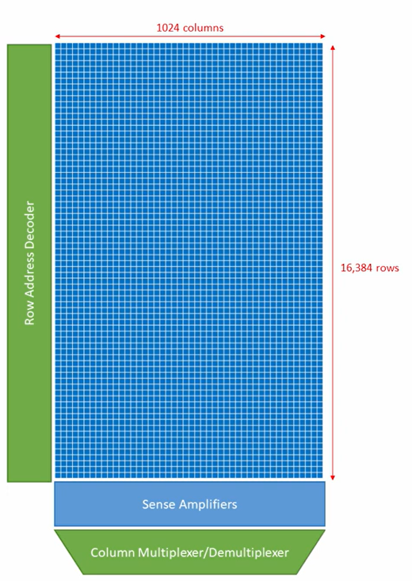

## Banks

  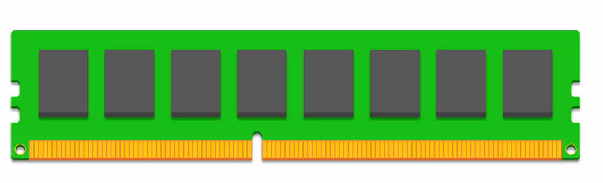

- Multiple banks are then attached to the DRAM chip, this DRAM chip supports a channel for reading and writing datas

  

- The group of DRAM banks is known as a rank.

- In modern CPU, multiple channels can be ultilized to enable large bandwidth. The data orchestration would be controlled through a DRAM controller.

  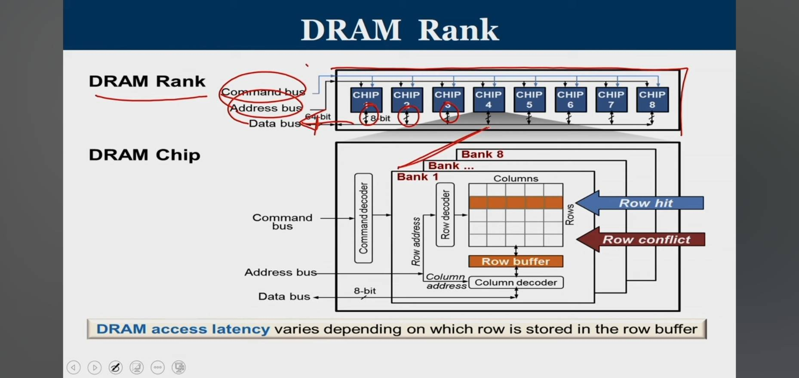

# Burst Mode and Bank Interleaving
## Ranks on same board

  

- Usually double ranks are fitted onto the same board forther less pins by sharing pin.

## Data address command line and memory channel

  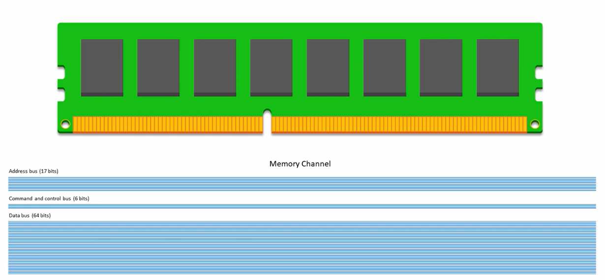

- 17 Address line can be used to to access more the 2^17 addresses.

## Double Data Rate(DDR)

  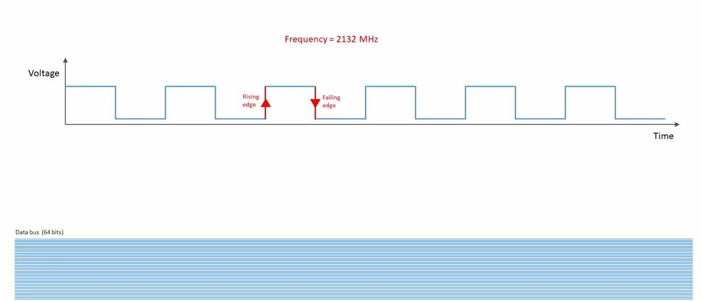

- Since dram data can be read or write during every clock edge, we call this kind of architecture as double data rate architecture.

## Burst MODE

  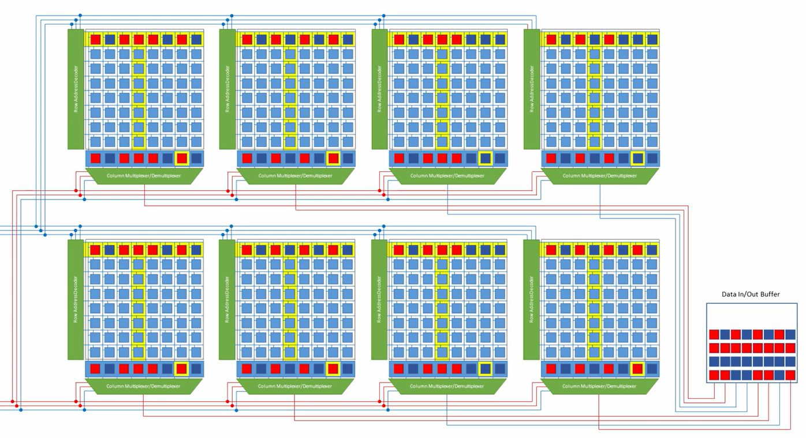

- When opening banks, one must first latch the row into the latch within each cell, then selects the data using the column decoder.
- So in order to increase throughput, we simply buffered the whole rows of datas into a data buffer because the whole row in each cell is already activated, this is known as the burst mode.

- Since reading out data is a destrutive operation, requiring recharging the row, this is not a easy task.

- Different generation of DRAM supports different burst length, for example DDR2(Double data rate 2) support a burst length of 4 while DDR4 support a burst length of 16.

## Interleaving

  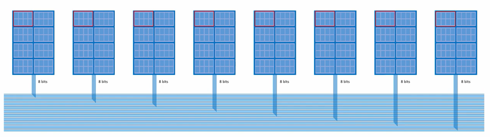

- Modern architecture supports 64 bits of data. This rank consists of multiple dram banks. Activating a the cell within each banks is the duty of DRAM controller.
- Since all reading and writing requires precharge and discharge, and all memory arrays within a bank acts independetly, one can interleave them to increase throughput. I.e. when the 1st memory array is reading, the next memory array is preparing for reading.

## Choosing bank sizes and number of banks

- More banks enables larger bit lines, and more data to be read out at the same time. However, since the bank is so large, smaller amount data stored.
- Fewer banks leads to higher capacity, more data can be stored however, larger bank sizes, yet speed is slower due to less banks for activation at the same time.

  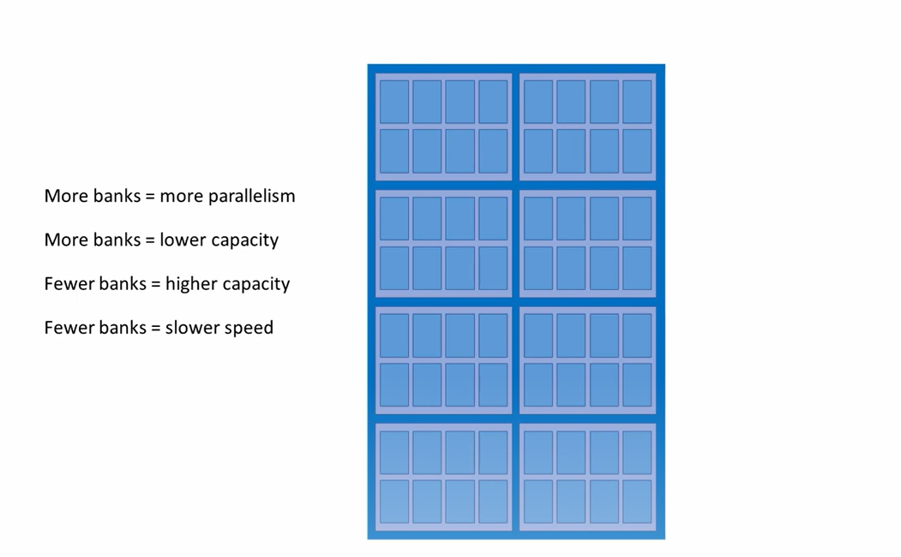

# Bank Interleaving operation
- Timing diagram of bank interleaving for increasing throughput

  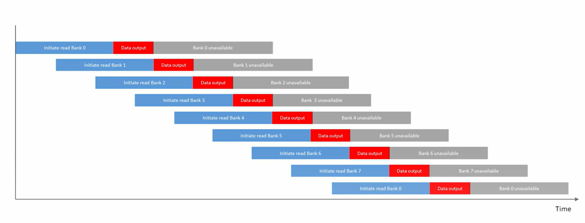

- Notice that after each bank reading, the bank becomes unavaible due to recharging of the bank. Thus interleaving can be used to increase throughput, i.e. the next bank gets activated while the previous bank is still reading or writing.

# Bank interleaving address mapping

  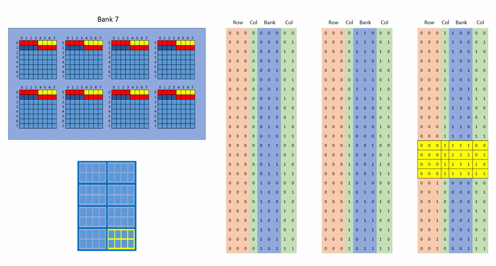

- Notice that column address is arranged in a peculiar way, however, this enables a brilliant data access pattern.
- Notice that the column automatically swap due to the arrangement of the address.
- Rewatch the video if you cannot understand

[Bank inerleaving example](https://youtu.be/-xtWsQvOcjo?t=110)