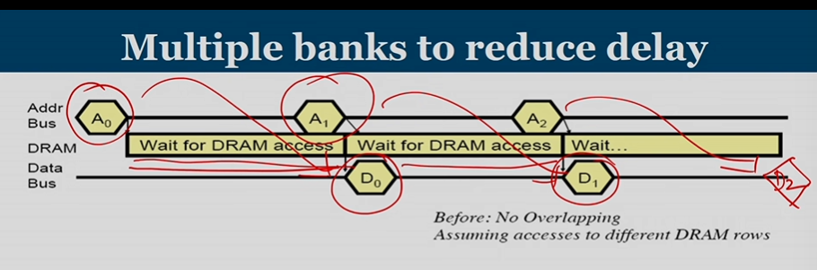
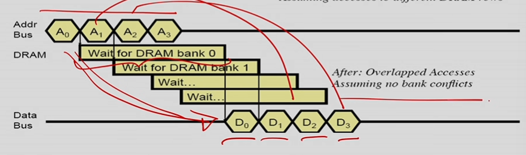
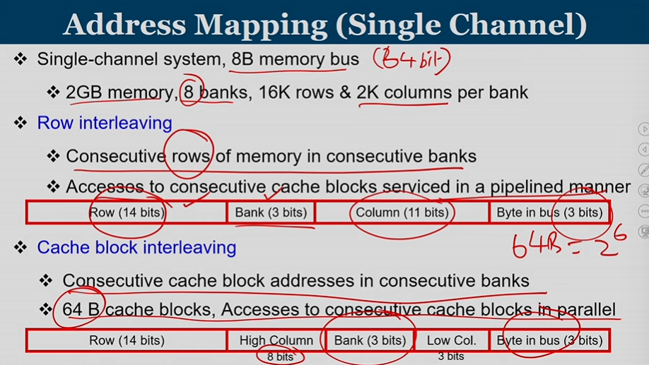
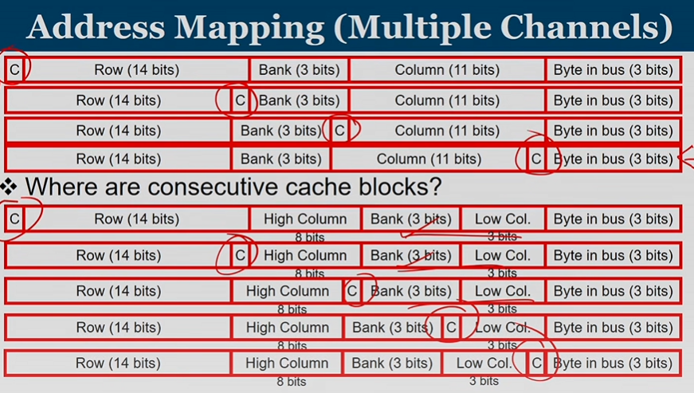
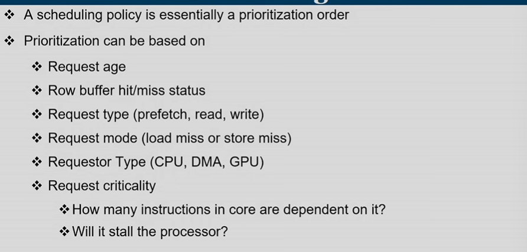
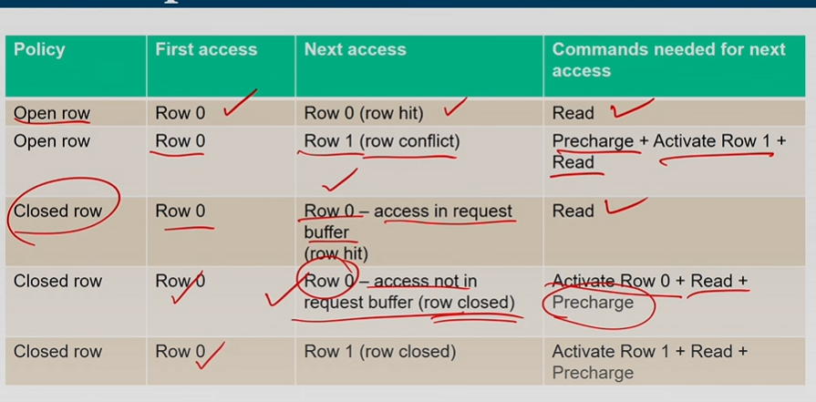
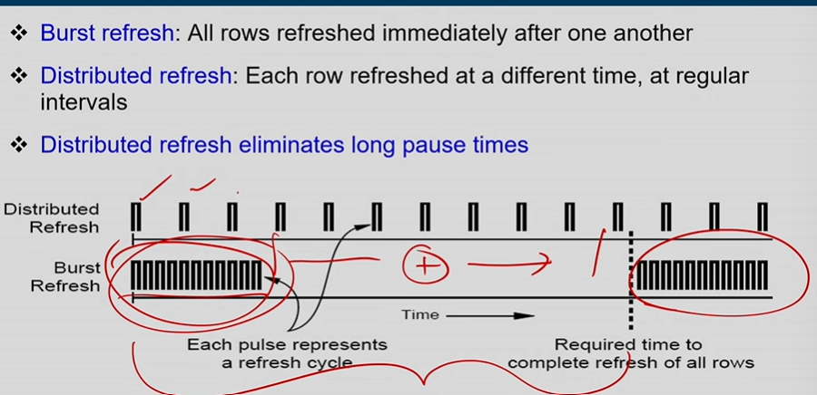

# DRAM Controller and address mapping
https://www.youtube.com/watch?v=5o5GbtNZgD4&t=154s
## Basic DRAM oepration
- DRAM controller has queing and scheduling delay also the conversin of basic commands for DRAM.
- Data flows from bus to memory, there is a bus latency.
- DRAM bank latency due to time for row is opened, also the neede time for precharging.
- PRE(Precharing) , Column address strobe(CAS) , RAS(Row address strobe)

- PRE + RAS + CAS

## Parralliztion in DRAM
- Multiple banks solution to read out multiple bits all at once, with the correct timing delay, after #1 Bank data transfered, the second bank is ready for transfer.
- Bank level parrallelism s.t. different banks can be accessed in the adjacent cycles.
- Multiple channels can also be used, yet this leads to more power and more area.

## Conflicts
- Channel conflict and bank conflicts.
- Note when the same address given, while accessing Bank or Channel, conflicts occur, then we must handle such hazard.

## Data Access latency
- Ideal condition is there is no bank conflicts.
- Note consecutive address is given for DRAM to pipeline out the DRAM data.

  

  

## Address Mapping(Single Channel)

  

### Row interleaving
- Data row would not be stored within the same bank. 210 row -> bank1 211 row -> bank2 ...

### Cache block interleaving
- Keeping the needed cache block data within conscutive DRAM banks, since eventually we need to send the data to processor.

## Address mapping(Multiple Channel)

  

- Channel bits are added into address.

## Virtual address -> Physical address
- We use the converted physical address into the row or cache interleaving address mapping for DRAM access.
- Banking level must to prevent, the bank number should be unique, the operating system plays a row in deciding which frame should be mapping.

# DRAM Controllers: Functions
- Handling resource conflicts(banks, bus,channels), want minimum write-to-read delays
- Translting requests to DRAM command seqences
- Buffer and scheduling for improvement.

## DRAM scheduling policies
- FCFS
Oldest request first

- FR-FCFS
When given a request, this request access the row in DRAM, row opened. Thus we simply find out which requests maps to the same row, make it a higher priority. We can make these requests get their wanted data, since row has already been opened.

- A scheduling policy is a prioritization order.

## Priority of request

  

## Row Buffer Management Policies
### Open row
- Keep the row opened after access
- We guess that the next access also belongs to the same row. If mispredicted, waste of energy.

### Closed row
- Close row after access, we use the precharge signal to close the whole row.
- If different row, we can avoid a row conflict.
- If same row, need extra activate latency.

### Adaptive policies.
- Predicting which policies should be used, profiling the application, which is suitable, open row or closed row policies.

## Row Opened v.s. Row closed.

  

# DRAM refresh

  

- Note DRAM cells has to be refreshed periodically.
- Memory controller needs to read row periodically for charge restoration, activation + precharing. During refreshing, no requests can be handled.
- Refreshing is basically entire row transfered to row buffer, then store back the data from row buffer.
